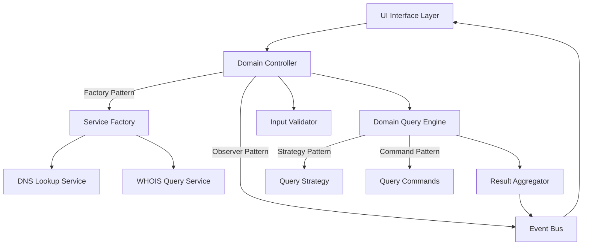
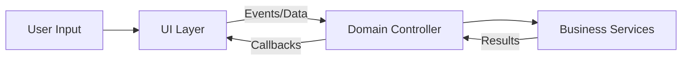

# Design Document: Domain Availability Checker

## Overview

The Domain Availability Checker is a client-side web application that provides real-time domain availability checking across multiple TLDs. The system uses a hybrid approach combining DNS lookups for initial filtering and WHOIS/RDAP queries for definitive availability status. The application is designed to be simple, fast, and privacy-focused with no data persistence.

Based on research, there are two primary methods for checking domain availability:
1. **DNS Lookup**: Fast but not 100% reliable (domains can be registered without DNS records)
2. **WHOIS/RDAP Query**: Most reliable but rate-limited by registries

Our design implements a hybrid approach: DNS lookups for quick initial checks, followed by WHOIS queries for definitive results where needed.

## Architecture

The application follows a clean, layered architecture with multiple design patterns for robustness:



### Key Architectural Principles

- **Strict UI/Logic Separation**: UI layer only handles presentation and user interactions, never business logic
- **Stateless Design**: No data persistence or session storage
- **Concurrent Processing**: Parallel domain checks for performance
- **Graceful Degradation**: Fallback mechanisms for network failures
- **Separation of Concerns**: Clear boundaries between UI, validation, and query logic
- **Dependency Inversion**: UI depends on abstractions, not concrete implementations
- **Design Patterns Integration**: Observer, Factory, Strategy, and Command patterns for flexibility

## Design Patterns Implementation

### 1. Observer Pattern (Event-Driven Architecture)
**Purpose**: Decouple UI updates from business logic execution
**Implementation**: Event Bus system for loose coupling between components

```typescript
interface IEventBus {
  subscribe<T>(event: string, handler: (data: T) => void): void;
  unsubscribe(event: string, handler: Function): void;
  publish<T>(event: string, data: T): void;
}

// Events
enum DomainEvents {
  VALIDATION_ERROR = 'validation_error',
  CHECK_STARTED = 'check_started',
  RESULT_UPDATED = 'result_updated',
  CHECK_COMPLETED = 'check_completed',
  ERROR_OCCURRED = 'error_occurred'
}
```

### 2. Factory Pattern (Service Creation)
**Purpose**: Create appropriate query services based on domain/TLD requirements
**Implementation**: Service factory for DNS/WHOIS service instantiation

```typescript
interface IQueryService {
  checkDomain(domain: string): Promise<DomainResult>;
  getServiceType(): 'DNS' | 'WHOIS';
}

interface IServiceFactory {
  createDNSService(): IQueryService;
  createWHOISService(): IQueryService;
  createHybridService(): IQueryService;
}
```

### 3. Strategy Pattern (Query Execution)
**Purpose**: Switch between different domain checking strategies dynamically
**Implementation**: Different strategies for DNS-only, WHOIS-only, or hybrid checking

```typescript
interface IQueryStrategy {
  execute(domain: string): Promise<DomainResult>;
  canHandle(domain: string): boolean;
  getPriority(): number;
}

class DNSFirstStrategy implements IQueryStrategy { /* ... */ }
class WHOISOnlyStrategy implements IQueryStrategy { /* ... */ }
class HybridStrategy implements IQueryStrategy { /* ... */ }
```

### 4. Command Pattern (Query Operations)
**Purpose**: Encapsulate domain queries as objects for better control and retry logic
**Implementation**: Command objects for each domain check operation

```typescript
interface ICommand<T> {
  execute(): Promise<T>;
  undo?(): Promise<void>;
  canRetry(): boolean;
  getRetryCount(): number;
}

class DomainCheckCommand implements ICommand<DomainResult> {
  constructor(
    private domain: string,
    private strategy: IQueryStrategy,
    private maxRetries: number = 3
  ) {}
  
  async execute(): Promise<DomainResult> { /* ... */ }
  canRetry(): boolean { /* ... */ }
}
```

### 5. Repository Pattern (Result Management)
**Purpose**: Abstract data access and provide consistent interface for results
**Implementation**: In-memory repository for current session results

```typescript
interface IDomainResultRepository {
  save(result: DomainResult): void;
  findByDomain(domain: string): DomainResult | null;
  findAll(): DomainResult[];
  clear(): void;
}
```

### 6. State Pattern (UI State Management)
**Purpose**: Manage complex UI state transitions cleanly
**Implementation**: State objects for different application states

```typescript
interface IApplicationState {
  handleInput(input: string): void;
  handleSubmit(): void;
  handleResult(result: DomainResult): void;
  handleError(error: string): void;
}

class IdleState implements IApplicationState { /* ... */ }
class CheckingState implements IApplicationState { /* ... */ }
class CompletedState implements IApplicationState { /* ... */ }
class ErrorState implements IApplicationState { /* ... */ }
```

## UI/Logic Separation Architecture

### Separation Principles

The application strictly separates presentation (UI) from business logic to ensure:
- **Testability**: Business logic can be tested independently of UI
- **Maintainability**: Changes to UI don't affect business logic and vice versa
- **Reusability**: Business logic can be reused with different UI implementations
- **Single Responsibility**: Each layer has one clear purpose

### Communication Flow



### Interface Contracts

#### UI → Controller Interface
```typescript
interface IDomainController {
  checkDomainAvailability(baseDomain: string): Promise<void>;
  registerCallbacks(callbacks: UICallbacks): void;
  getCurrentState(): ApplicationState;
}

interface UICallbacks {
  onValidationError(message: string): void;
  onCheckStarted(domains: string[]): void;
  onResultUpdate(result: DomainResult): void;
  onCheckCompleted(results: DomainResult[]): void;
  onError(error: string): void;
}
```

#### Controller → Services Interface
```typescript
interface IDomainQueryEngine {
  checkMultipleTLDs(baseDomain: string, tlds: string[]): Promise<DomainResult[]>;
}

interface IInputValidator {
  validateDomainName(domain: string): ValidationResult;
}
```

### Forbidden Dependencies

- **UI CANNOT**: Call services directly, perform validation, execute business logic
- **Services CANNOT**: Access DOM, handle UI events, manage UI state
- **Controller CANNOT**: Manipulate DOM directly, handle UI-specific concerns

## Components and Interfaces

### UI Interface Layer

**Responsibilities:**
- **PRESENTATION ONLY**: Render input form and results display
- **USER INTERACTION**: Handle DOM events and form submissions
- **VISUAL FEEDBACK**: Display loading states and error messages
- **RESPONSIVE DESIGN**: Provide responsive design across devices
- **NO BUSINESS LOGIC**: Never perform validation, processing, or data manipulation

**Key Methods:**
- `renderInputForm()`: Display domain input field and submit button
- `displayResults(domainResults)`: Show availability status for each domain
- `showLoadingState(domains)`: Display loading indicators
- `displayError(errorMessage)`: Show error messages to user
- `bindEventHandlers()`: Attach DOM event listeners
- `updateUIState(state)`: Update UI based on application state

**Strict Boundaries:**
- UI components receive data through interfaces/callbacks
- UI never directly calls business logic services
- All user input is immediately passed to the controller layer
- UI state changes only through controller-provided callbacks

### Domain Controller

**Responsibilities:**
- **ORCHESTRATION**: Coordinate the domain checking workflow using Command pattern
- **UI ABSTRACTION**: Provide clean interface between UI and business logic
- **STATE MANAGEMENT**: Manage application state using State pattern
- **ERROR HANDLING**: Convert business errors to UI-friendly messages
- **EVENT COORDINATION**: Publish events through Event Bus

**Key Methods:**
- `checkDomainAvailability(baseDomain)`: Main entry point for domain checks
- `validateAndProcess(input)`: Validate input and initiate processing
- `handleResults(results)`: Process and format results for UI display
- `registerUICallbacks(callbacks)`: Register UI update callbacks
- `getApplicationState()`: Provide current state to UI
- `executeCommand(command)`: Execute domain check commands
- `changeState(newState)`: Transition to new application state

**Design Patterns Used:**
- **Command Pattern**: Encapsulates domain check operations
- **State Pattern**: Manages application state transitions
- **Observer Pattern**: Publishes events to Event Bus

### Input Validator

**Responsibilities:**
- Validate domain name format and characters
- Ensure domain length constraints
- Sanitize user input

**Key Methods:**
- `validateDomainName(domain)`: Check domain format and characters
- `sanitizeInput(input)`: Clean and normalize user input
- `isValidLength(domain)`: Verify domain length constraints (1-63 characters)

### Domain Query Engine

**Responsibilities:**
- Execute domain availability checks using Strategy pattern
- Coordinate DNS and WHOIS queries through Service Factory
- Handle concurrent processing and timeouts using Command pattern
- Manage query strategies based on domain characteristics

**Key Methods:**
- `checkMultipleTLDs(baseDomain, tlds)`: Check availability across TLD list
- `processDomainsParallel(domains)`: Execute concurrent domain checks
- `handleQueryFailures(failures)`: Manage failed queries and retries
- `selectStrategy(domain)`: Choose appropriate query strategy
- `executeCommands(commands)`: Execute multiple domain check commands

**Design Patterns Used:**
- **Strategy Pattern**: Different query strategies (DNS, WHOIS, Hybrid)
- **Command Pattern**: Encapsulated query operations with retry logic
- **Factory Pattern**: Creates appropriate query services

### DNS Lookup Service

**Responsibilities:**
- Perform DNS resolution checks
- Provide fast initial availability assessment
- Handle DNS query timeouts and errors

**Key Methods:**
- `performDNSLookup(domain)`: Execute DNS resolution check
- `isDNSResolvable(domain)`: Determine if domain has DNS records
- `handleDNSTimeout(domain)`: Manage DNS query timeouts

### WHOIS Query Service

**Responsibilities:**
- Execute WHOIS/RDAP queries for definitive availability
- Parse WHOIS responses for registration status
- Handle rate limiting and query failures

**Key Methods:**
- `performWHOISQuery(domain)`: Execute WHOIS lookup
- `parseWHOISResponse(response)`: Extract availability from WHOIS data
- `handleRateLimit()`: Manage WHOIS query rate limiting

### Result Aggregator

**Responsibilities:**
- Combine DNS and WHOIS results using Repository pattern
- Determine final availability status
- Format results for UI consumption
- Manage result caching for current session

**Key Methods:**
- `aggregateResults(dnsResults, whoisResults)`: Combine query results
- `determineFinalStatus(domain, dnsStatus, whoisStatus)`: Calculate final availability
- `formatForDisplay(results)`: Prepare results for UI rendering
- `cacheResult(result)`: Store result in repository
- `getCachedResults()`: Retrieve all cached results

**Design Patterns Used:**
- **Repository Pattern**: Manages result storage and retrieval

### Event Bus

**Responsibilities:**
- Provide loose coupling between components using Observer pattern
- Handle event subscription and publishing
- Ensure type-safe event communication
- Manage event lifecycle and cleanup

**Key Methods:**
- `subscribe<T>(event, handler)`: Register event handler
- `unsubscribe(event, handler)`: Remove event handler
- `publish<T>(event, data)`: Emit event with data
- `clear()`: Remove all subscriptions

**Design Patterns Used:**
- **Observer Pattern**: Core implementation for event-driven architecture

### Service Factory

**Responsibilities:**
- Create appropriate query services using Factory pattern
- Manage service dependencies and configuration
- Provide service instances based on requirements
- Handle service lifecycle management

**Key Methods:**
- `createDNSService()`: Create DNS lookup service
- `createWHOISService()`: Create WHOIS query service
- `createHybridService()`: Create hybrid query service
- `getServiceByType(type)`: Get service by type
- `configureService(service, config)`: Configure service instance

**Design Patterns Used:**
- **Factory Pattern**: Creates and configures service instances

### Application State Manager

**Responsibilities:**
- Manage application state transitions using State pattern
- Coordinate state changes with UI updates
- Ensure valid state transitions
- Handle state persistence for current session

**Key Methods:**
- `getCurrentState()`: Get current application state
- `transitionTo(newState)`: Change to new state
- `canTransitionTo(state)`: Check if transition is valid
- `getStateHistory()`: Get state transition history
- `resetToIdle()`: Reset to initial state

**Design Patterns Used:**
- **State Pattern**: Manages complex state transitions

## Data Models

### Core Domain Models

#### DomainResult

```typescript
interface DomainResult {
  domain: string;           // Full domain name (e.g., "synth.com")
  baseDomain: string;       // Base name (e.g., "synth")
  tld: string;             // Top-level domain (e.g., ".com")
  status: AvailabilityStatus;
  lastChecked: Date;
  checkMethod: 'DNS' | 'WHOIS' | 'HYBRID';
  error?: string;
  retryCount?: number;
  executionTime?: number;
}
```

#### AvailabilityStatus

```typescript
enum AvailabilityStatus {
  AVAILABLE = 'available',
  TAKEN = 'taken',
  CHECKING = 'checking',
  ERROR = 'error',
  UNKNOWN = 'unknown'
}
```

#### QueryRequest

```typescript
interface QueryRequest {
  baseDomain: string;
  tlds: string[];
  timestamp: Date;
  requestId: string;
  strategy?: QueryStrategyType;
}
```

#### QueryResponse

```typescript
interface QueryResponse {
  requestId: string;
  results: DomainResult[];
  completedAt: Date;
  errors: QueryError[];
  totalExecutionTime: number;
}
```

#### QueryError

```typescript
interface QueryError {
  domain: string;
  errorType: 'NETWORK' | 'TIMEOUT' | 'RATE_LIMIT' | 'INVALID_RESPONSE';
  message: string;
  retryable: boolean;
  timestamp: Date;
}
```

### Pattern-Specific Models

#### Command Models

```typescript
interface ICommand<T> {
  execute(): Promise<T>;
  undo?(): Promise<void>;
  canRetry(): boolean;
  getRetryCount(): number;
  getId(): string;
}

interface CommandResult<T> {
  success: boolean;
  data?: T;
  error?: string;
  executionTime: number;
}
```

#### Event Models

```typescript
interface DomainEvent<T = any> {
  type: string;
  data: T;
  timestamp: Date;
  source: string;
}

interface ValidationErrorEvent {
  message: string;
  field: string;
  value: string;
}

interface CheckStartedEvent {
  domains: string[];
  requestId: string;
  strategy: string;
}

interface ResultUpdatedEvent {
  result: DomainResult;
  progress: {
    completed: number;
    total: number;
  };
}
```

#### State Models

```typescript
enum ApplicationStateType {
  IDLE = 'idle',
  VALIDATING = 'validating',
  CHECKING = 'checking',
  COMPLETED = 'completed',
  ERROR = 'error'
}

interface ApplicationStateContext {
  currentInput: string;
  results: DomainResult[];
  errors: QueryError[];
  progress: {
    completed: number;
    total: number;
  };
}
```

#### Strategy Models

```typescript
enum QueryStrategyType {
  DNS_FIRST = 'dns_first',
  WHOIS_ONLY = 'whois_only',
  HYBRID = 'hybrid',
  FAST_CHECK = 'fast_check'
}

interface StrategyConfig {
  timeout: number;
  retries: number;
  fallbackStrategy?: QueryStrategyType;
  priority: number;
}
```
### Pattern Integration Benefits

#### Maintainability
- **Observer Pattern**: Easy to add new UI components without changing business logic
- **Factory Pattern**: Simple to add new query service types
- **Strategy Pattern**: Easy to modify or add new query strategies
- **Command Pattern**: Simple to add new operations or modify retry logic
- **State Pattern**: Clear state transitions and easy to add new states

#### Testability
- **Observer Pattern**: UI and business logic can be tested independently
- **Factory Pattern**: Services can be mocked easily for testing
- **Strategy Pattern**: Each strategy can be unit tested in isolation
- **Command Pattern**: Commands can be tested independently with retry scenarios
- **State Pattern**: State transitions can be tested systematically

#### Extensibility
- **Observer Pattern**: New event types can be added without breaking existing code
- **Factory Pattern**: New service implementations can be added without changing client code
- **Strategy Pattern**: New query algorithms can be plugged in seamlessly
- **Command Pattern**: New command types can be added for different operations
- **State Pattern**: New application states can be added with proper transitions

#### Performance
- **Observer Pattern**: Efficient event-driven updates reduce unnecessary processing
- **Factory Pattern**: Service instances can be cached and reused
- **Strategy Pattern**: Optimal strategy selection based on domain characteristics
- **Command Pattern**: Batch processing and parallel execution of commands
- **State Pattern**: Efficient state-specific behavior without conditional logic

## Correctness Properties

*A property is a characteristic or behavior that should hold true across all valid executions of a system—essentially, a formal statement about what the system should do. Properties serve as the bridge between human-readable specifications and machine-verifiable correctness guarantees.*

Based on the requirements analysis, the following properties ensure the system behaves correctly across all valid inputs and scenarios:

### Property 1: Domain Input Validation
*For any* user input string, the system should accept it as a valid domain name if and only if it contains only alphanumeric characters and hyphens, has length between 1 and 63 characters, and does not start or end with a hyphen.
**Validates: Requirements 1.1, 1.2, 5.1, 5.3**

### Property 2: Comprehensive TLD Processing
*For any* valid base domain name, the system should check availability across all configured TLDs (.com, .net, .org, .ai, .dev, .io, .co) and return individual results for each TLD with proper domain formatting (baseDomain + TLD).
**Validates: Requirements 2.1, 2.2, 5.2**

### Property 3: Concurrent Query Execution
*For any* domain availability check request, all TLD queries should execute concurrently rather than sequentially, and the total execution time should be approximately equal to the slowest individual query rather than the sum of all queries.
**Validates: Requirements 2.3**

### Property 4: Result Format Consistency
*For any* domain query result, the response should contain a consistent data structure with domain name, availability status, and metadata fields as defined in the DomainResult interface.
**Validates: Requirements 2.4, 5.4**

### Property 5: UI State Responsiveness
*For any* domain check operation, the UI should immediately update to reflect the current state (checking, completed, error) and the submit button should be disabled during active checks and re-enabled when checks complete.
**Validates: Requirements 3.2, 6.2, 6.3**

### Property 6: Error Isolation and Handling
*For any* set of domain queries where some fail due to network issues or timeouts, the failed queries should be marked with error status without affecting the success or failure of other concurrent queries.
**Validates: Requirements 4.1, 4.2, 4.3, 4.4**

### Property 7: Stateless Operation
*For any* sequence of user interactions, the system should not persist any user input, search history, or application state, and each session should start with a clean state regardless of previous usage.
**Validates: Requirements 7.1, 7.3, 7.4**

## Error Handling

The system implements comprehensive error handling across multiple layers:

### Input Validation Errors
- **Invalid Characters**: Display specific error message for domains containing invalid characters
- **Length Violations**: Show clear feedback for domains that are too short or too long
- **Empty Input**: Provide helpful prompt when no domain is entered

### Network and Query Errors
- **Connection Failures**: Detect network unavailability and display appropriate message
- **Timeout Handling**: Set reasonable timeouts (5-10 seconds) for domain queries
- **Rate Limiting**: Handle WHOIS rate limits gracefully with exponential backoff
- **Partial Failures**: Continue processing successful queries when some fail

### Service Degradation
- **DNS Fallback**: Use DNS-only results when WHOIS services are unavailable
- **Retry Mechanisms**: Provide user-initiated retry for failed queries
- **Graceful Degradation**: Show partial results rather than complete failure

### Error Recovery Strategies
- **Automatic Retry**: Implement exponential backoff for transient failures
- **User-Initiated Retry**: Allow users to retry failed checks manually
- **Clear Error Messages**: Provide actionable error messages explaining what went wrong

## Testing Strategy

The testing approach combines unit tests for specific scenarios with property-based tests for comprehensive coverage:

### Unit Testing Focus
- **Input Validation Edge Cases**: Test specific invalid inputs (empty strings, special characters)
- **Error Conditions**: Test specific network failure scenarios
- **UI State Transitions**: Test specific user interaction flows
- **Integration Points**: Test component interactions and data flow

### Property-Based Testing Configuration
- **Testing Library**: Use a property-based testing framework appropriate for the chosen implementation language
- **Test Iterations**: Configure minimum 100 iterations per property test
- **Test Tagging**: Each property test references its corresponding design property
- **Coverage**: Property tests validate universal behaviors across all valid inputs

### Dual Testing Benefits
- **Unit Tests**: Catch specific bugs and validate concrete examples
- **Property Tests**: Verify general correctness across input space
- **Comprehensive Coverage**: Together provide both specific and general validation
- **Regression Prevention**: Ensure changes don't break existing functionality

### Test Data Generation
- **Valid Domains**: Generate random valid domain names with various lengths and character combinations
- **Invalid Inputs**: Generate strings with invalid characters, lengths, and formats
- **Network Conditions**: Simulate various network failure and timeout scenarios
- **TLD Combinations**: Test with different TLD sets and availability responses

Each property-based test should be tagged with the format:
**Feature: domain-availability-checker, Property {number}: {property_text}**